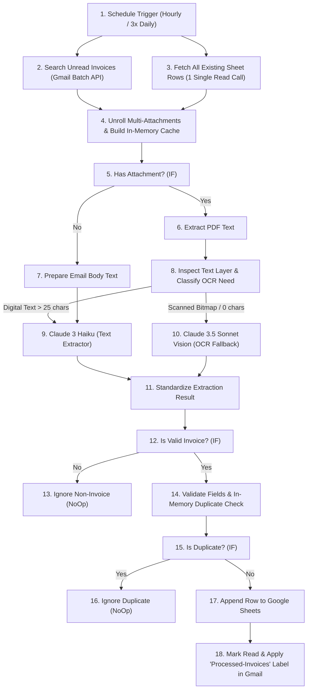

# Novus Realty Invoice Processor — Version 2 (Scheduled Batch & Multimodal Pipeline)

This folder contains the **Version 2 (Advanced)** implementation of the Intelligent Invoice Processing system. It builds upon all baseline requirements and incorporates enterprise considerations: **Scheduled Batching**, **In-Memory Deduplication**, **Multi-Attachment Unrolling**, **Multimodal Vision OCR**, and **Two-Way Gmail State Synchronization**.

---

## 📁 File Manifest

| File | Purpose |
| :--- | :--- |
| [`novus-invoice-processor.json`](file:///Users/chukwudike/Portfolio/2026/koya/1/v2/novus-invoice-processor.json) | Complete 21-node n8n workflow blueprint ready for import. |
| [`one-pager.md`](file:///Users/chukwudike/Portfolio/2026/koya/1/v2/one-pager.md) | Comprehensive executive one-pager & system operating manual. |
| [`rationale.md`](file:///Users/chukwudike/Portfolio/2026/koya/1/v2/rationale.md) | Node-by-node architectural defense and requirement comparison. |
| [`reflections.md`](file:///Users/chukwudike/Portfolio/2026/koya/1/v2/reflections.md) | Critical analysis of model selection, cost tradeoffs, and lessons learned. |
| [`test-evidence.md`](file:///Users/chukwudike/Portfolio/2026/koya/1/v2/test-evidence.md) | Empirical testing results for the 10 test pack emails + advanced edge cases. |

---

## ⚡ Key Improvements in Version 2

### 1. 98.3% Reduction in n8n Executions
- **v1**: 1-minute polling = 1,440 executions/day (43,200/month).
- **v2**: Hourly schedule = 24 executions/day (720/month).

### 2. Multi-Attachment Unrolling
- In v1, an email with multiple invoice PDFs only processed `attachment_0`.
- In v2, Node 4 detects all binary attachments and generates discrete execution items for every attached invoice, logging each as an independent row in Google Sheets.

### 3. Multimodal Vision OCR Fallback (TP-07b)
- In v1, scanned image PDFs without a text layer were caught and logged as `failed`.
- In v2, Node 7 detects zero-text-layer files and routes them to **Claude 3.5 Sonnet Vision**, which visually reads the bitmap image, extracts invoice details, and logs a valid structured row.

### 4. Single-Shot Database Reads & In-Memory Deduplication
- In v1, every single email triggered a separate `Get Rows` read from Google Sheets.
- In v2, Google Sheets is queried **once per batch**. Known invoices are stored in an in-memory `Set`, enabling instant sub-millisecond deduplication.

### 5. Gmail State Synchronization
- In v2, successfully logged emails are automatically marked as **Read** and tagged with the **`Processed-Invoices`** label, preventing re-processing across future runs.
