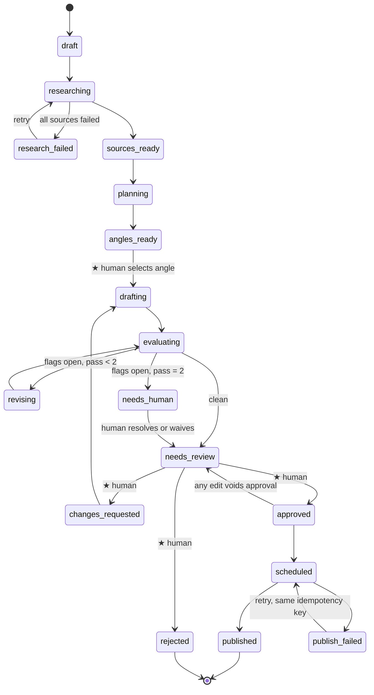
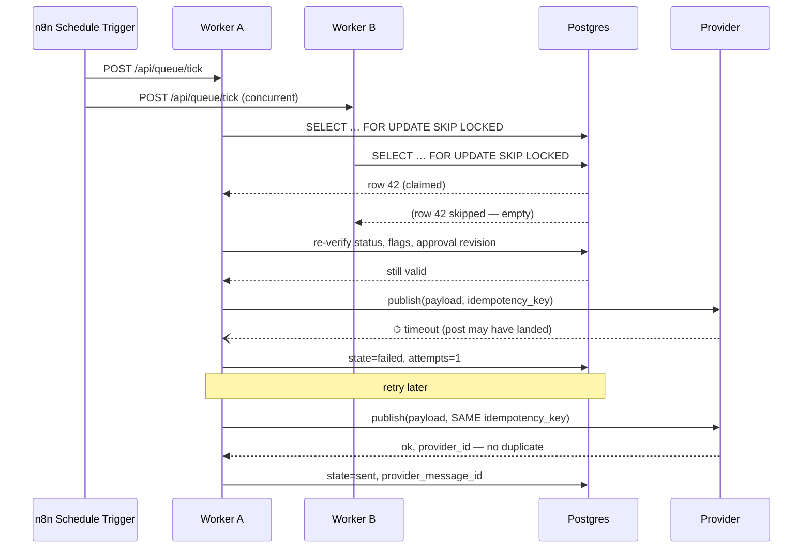
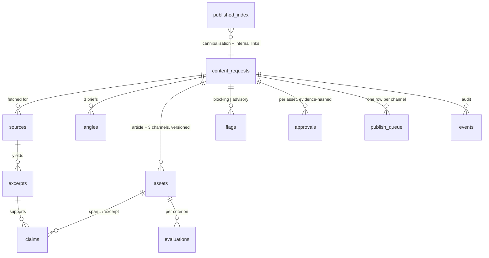
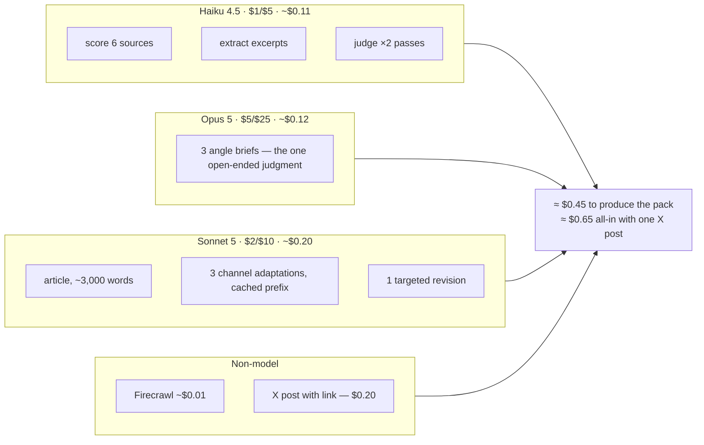

# Koya Content Desk — Architecture

**Owner:** Ikechukwu · **Date:** 2026-09-15
**Specs:** [PRD4-extended.md](../PRD4-extended.md) · [design-notes.md](../design-notes.md) · [IMPLEMENTATION.md](../IMPLEMENTATION.md)

Six views. The first is the one to put in the video and the one-pager; the rest exist because the interesting behaviour is in the gates, the loop bound, and the concurrency — none of which a single box-and-arrow picture can show.

---

## 1. System flow

Read it top to bottom. The two ★ boxes are the only places a human decides, and the 🔒 boxes are the only things that can stop publication.

```mermaid
flowchart TD
    A["Content manager<br/>idea · audience · goal · channels · URLs"] --> B["POST /api/requests<br/>idempotency key"]

    B --> C{{"Cannibalisation check<br/>pgvector · zero model cost"}}
    C -->|"≥ threshold match"| C1["STOP — 'we published this 6 weeks ago.<br/>Update it instead?'"]
    C -->|"no match"| D

    subgraph RESEARCH["① Research — own the bytes"]
        D["Firecrawl /v2/search<br/>discovery + competing articles"] --> E["Firecrawl /v2/scrape<br/>onlyMainContent · maxAge 48h · parsers pdf"]
        E -->|"402 / 429 / timeout"| E2["Claude web_fetch<br/>free beyond tokens"]
        E2 -->|"still failing"| E3["Manual paste"]
        E --> F["Per source: robots · dedupe by hash ·<br/>boilerplate ratio · PDF page cap ·<br/>parse heading structure → words per H2"]
        E2 --> F
        E3 --> F
    end

    F --> G["🔒 Injection screen<br/>invisible Unicode · marker scan"]
    G -->|"flagged"| G1["QUARANTINE<br/>excluded from pool · reviewer told"]
    G -->|"clean"| H

    subgraph SELECT["② Select — curate, don't dump"]
        H["Haiku 4.5 · score sources<br/>relevance · recency · authority · substance"] --> I["Haiku 4.5 · extract excerpts<br/>labelled S3¶7 with char offsets"]
        I --> I2["Classify keywords topical vs supporting long-tail<br/>+ derive section depth band from comparables<br/>median words/H2 · 700–800 fallback"]
    end

    I2 --> J["Opus 5 · three angle briefs<br/>each cites its excerpt IDs"]
    J --> K["★ GATE 1 — human selects the angle<br/>presented in randomised order"]

    K --> L["Sonnet 5 · article<br/>derived depth band · Grade 7 · image slot<br/>citation contract · NEEDS SOURCE on gaps"]
    L --> M["Sonnet 5 ×3 in parallel<br/>LinkedIn · X · Newsletter<br/>shared cached prefix"]

    M --> N

    subgraph EVAL["③ Evaluate — cheapest first"]
        N["🔒 TIER 0 · deterministic · 0 tokens<br/>SEO · Flesch-Kincaid ≤7 · channel limits<br/>grounding · links resolve · verbatim overlap"]
        N --> O["TIER 1 · Haiku judge · blind to revision<br/>relevance · audience · tone · semantic grounding"]
    end

    O --> P{"Flags open?"}
    P -->|"yes · pass < 2"| Q["Sonnet 5 · targeted revision<br/>only failing sections"]
    Q --> R{"score improved?"}
    R -->|"no"| R1["Discard · keep parent"]
    R -->|"yes"| N
    R1 --> S
    P -->|"yes · pass = 2"| S["needs_human<br/>never auto-approved"]
    P -->|"no"| T

    S --> T["★ GATE 2 — human approval, per asset"]
    T --> U["🔒 Approve endpoint refuses on:<br/>open blocking flag · self-approval ·<br/>stale version · wrong status ·<br/>revision ≠ approved revision"]

    U --> V["publish_queue rows<br/>UNIQUE idempotency key"]

    subgraph PUB["④ Publish — the queue is the product"]
        W["n8n Schedule Trigger → /api/queue/tick"] --> X["Claim: FOR UPDATE SKIP LOCKED"]
        X --> Y["🔒 Re-verify at dispatch:<br/>status · flags · approval still valid"]
        Y --> Z1["Resend → newsletter"]
        Y --> Z2["LinkedIn w_member_social"]
        Y --> Z3["X pay-per-use · $0.20 w/ link"]
    end

    V --> W
    Z1 --> AA["sent — written only after provider confirms"]
    Z2 --> AA
    Z3 --> AB["no credentials → blocked / queued_manual<br/>NEVER sent"]

    AA --> AC[("events table<br/>correlation id · stage · outcome ·<br/>latency · measured cost")]
    AB --> AC
    C --> AC
    G --> AC
    N --> AC
    U --> AC
```



### What the diagram is arguing

- **The expensive models sit in the narrow middle.** Haiku does the per-source work, Opus runs once on the one open-ended judgment, Sonnet writes. Nothing costly runs in a loop over N sources.
- **Free checks precede paid ones.** Tier 0 is zero tokens, and it runs first — partly for cost, but mainly because `output_config.format` *cannot* express length or numeric bounds, so those rules have nowhere else to live.
- **Two humans decisions, not one.** Angle selection is where taste changes the outcome; approval is where liability does.
- **Nothing reaches a channel on a model's say-so.** Every path to a connector passes a 🔒.

---

## 2. The evaluation pipeline — what each tier costs and catches

```mermaid
flowchart LR
    D["Draft + 3 channel assets"] --> T0

    subgraph T0["TIER 0 · code · $0.00"]
        direction TB
        a1["one H1 · H2s present"]
        a2["keyword in title + first 100 words"]
        a3["section depth within derived band"]
        a4["Flesch–Kincaid grade ≤ 7"]
        a5["X ≤280 · ≤2 hashtags"]
        a6["LinkedIn CTA · ≤3-line paras · ≤5 emoji"]
        a7["newsletter 250–600 w + subject"]
        a8["every figure/date/name in an excerpt"]
        a9["every URL in source set AND resolves"]
        a10["verbatim overlap ≤ N words"]
        a11["image slot + alt text present"]
    end

    T0 -->|"survivors only"| T1

    subgraph T1["TIER 1 · Haiku 4.5 · ~$0.03/pass"]
        direction TB
        b1["topic relevance"]
        b2["audience fit"]
        b3["tone / brand voice"]
        b4["semantic grounding"]
        b5["factual consistency"]
    end

    T1 --> T2

    subgraph T2["TIER 2 · human · the only tier that can approve"]
        direction TB
        c1["sees claims highlighted in place"]
        c2["sees claim→excerpt map"]
        c3["sees per-criterion scores + evidence"]
        c4["sees revision diff"]
        c5["sees quarantined sources"]
        c6["approval hashes what was shown"]
    end

    CAL["Calibration set<br/>planted defects · Batch API 50%"] -.->|"must detect above threshold<br/>before the judge is trusted"| T1
```



Three properties worth naming:

1. **The judge is a different model from the writer.** Haiku judges Sonnet. Self-preference bias is measured, not theoretical — judges favour their own generations, and the documented mitigation is a different model.
2. **The judge is blind to revision number** and never sees its own prior scores, so it cannot anchor on itself.
3. **The judge is itself tested.** An evaluator nobody evaluated is decoration.

---

## 3. State machine



Every transition is `UPDATE … WHERE id = ? AND status = ? AND version = ?`. The edge that carries the most weight is `approved → needs_review`: **any edit voids the approval**, which is the one line that stops "a human approved it" from being defeated by approving a clean draft and editing it before the queue fires.

---

## 4. Publishing — why a duplicate post is impossible



Two mechanisms, each doing a different job:

- `FOR UPDATE SKIP LOCKED` stops **two workers** taking the same row.
- `UNIQUE (idempotency_key)` plus passing that key to the provider stops **one worker retrying** from posting twice.

*Timing out is not the same as not having posted.* A duplicate on a client's LinkedIn is the failure that gets an agency fired, so this is a database constraint rather than an intention.

---

## 5. Data model



The table that makes the whole thing auditable is `claims`: a span in a draft, joined to the excerpt that supports it, with the checker that decided. Six months later, *"where did this statistic come from?"* is one query.

---

## 6. Model routing and where the money goes



Against ~4 hours of a marketer's time per long-form post. Note the shape: **one X post costs almost half of what producing the entire pack costs**, which is why X publication is a per-request choice rather than a default-on checkbox.

---

## 7. ASCII version — for `one-pager.txt`

The one-pager ships as plain text, so it needs a diagram that survives having no renderer.

```
  MANAGER                                                    EDITOR
     |                                                          |
     v                                                          |
  [ intake ] --> {cannibalisation check} --STOP--> "update the existing post"
                            | no match                          |
                            v                                   |
  ============ RESEARCH ============                             |
  Firecrawl search+scrape --fail--> Claude web_fetch --fail--> manual
                            |                                   |
                            v                                   |
                   [ robots / dedupe / boilerplate ]            |
                            v                                   |
                   [ INJECTION SCREEN ] --flagged--> QUARANTINE |
                            v                                   |
  ============ SELECT ==============                             |
        Haiku: score sources -> extract labelled excerpts       |
        derive section-depth band from competitor words/H2        |
                            v                                   |
        Opus 5: three angle briefs (randomised order)           |
                            v                                   |
                 *** HUMAN GATE 1: pick the angle ***           |
                            v                                   |
  ============ WRITE ===============                             |
        Sonnet 5: article  ->  Sonnet 5 x3: LinkedIn / X / news |
                            v                                   |
  ============ EVALUATE ============                             |
     TIER 0  code, $0.00   -> SEO, Grade 7, channel limits,     |
                              grounding, links, verbatim        |
     TIER 1  Haiku judge   -> relevance, audience, tone         |
        (different model from the writer; blind to revision)    |
                            v                                   |
        flags open? --yes, pass<2--> targeted revision ---+     |
                     |                 (monotonic guard)  |     |
                     |<---------------------------------- +     |
                     +--yes, pass=2--> needs_human              |
                     |                                          |
                     v                                          v
                 *** HUMAN GATE 2: approve, per asset ***  <-----+
                            |
                            | refuses on: open blocking flag / self-approval /
                            | stale version / wrong status / edited since approval
                            v
  ============ PUBLISH =============
        publish_queue   [ UNIQUE idempotency key ]
                            ^
        n8n Schedule Trigger -> /api/queue/tick
                            v
        claim row: FOR UPDATE SKIP LOCKED
                            v
        re-verify: status / flags / approval still valid
                            v
        Resend (newsletter)  |  LinkedIn (member)  |  X (pay-per-use)
                            v
        sent  --written only after the provider confirms--
        blocked / queued_manual  --when credentials are absent; NEVER "sent"--

  every stage writes: correlation id | actor | outcome | latency | measured cost
```

---

## Notes carried in from the SEO document's own links

Reading the three links inside [`seo-best-practices.md`](../seo-best-practices.md) added two requirements and found one discrepancy:

| Source | Requirement it adds |
|---|---|
| [Ahrefs — long-tail vs short-tail](https://ahrefs.com/blog/long-tail-vs-short-tail-keywords/) | Long-tail is a position on the search demand curve, not a word count. The keyword step must separate **topical** long-tails (worth their own article) from **supporting** long-tails (belong inside a broader piece). Writing a full article against a supporting long-tail is the thin-content mistake the cannibalisation check exists to prevent — so this classification feeds that check, shown as `Classify keywords` in §1 |
| [Yoast — internal linking](https://yoast.com/internal-linking-for-seo-why-and-how/) | **Orphaned content**: a page with no *inbound* internal links is invisible to crawlers. Internal linking is therefore **bidirectional** — the published-content index must both supply outbound links for the new article *and* nominate which existing cornerstone pages should link back to it. Anchor text must describe the destination, and a weak-similarity link is worse than no link, because random internal linking damages relevance signals |
| [Klipfolio — external links](https://www.klipfolio.com/resources/kpi-examples/digital-marketing/external-links) | **Discrepancy, flagged honestly.** This page defines external links as *inbound backlinks to your domain* — a reporting KPI with "no universal benchmark" — not outbound citations in an article. The SEO document's "2–3 relevant internal or external links" can only mean outbound links to authoritative sources, so that is what is implemented, and the citation is noted as not describing the on-page practice |
